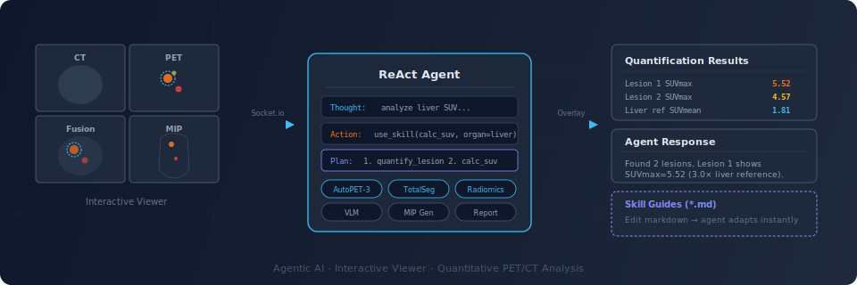

<p align="center">
  <h1 align="center">DICOMclaw</h1>
  <p align="center">
    <strong>An agentic AI framework for PET imaging</strong><br>
    Explores whole-body scans, integrates multimodal patient data, and quantitatively<br>
    characterizes tumor metabolism, tracer distribution, and treatment response.
  </p>
  <p align="center">
    <a href="#quick-start">Quick Start</a> · <a href="INSTALL.md">Install Guide</a> · <a href="#skills">Skills</a> · <a href="#reference">Reference</a> · <a href="#license">License</a>
  </p>
</p>

<p align="center">
  
</p>

---

## Why DICOMclaw?

Traditional PET/CT workflows involve switching between multiple tools — viewers, segmentation software, spreadsheets, and reporting systems. **DICOMclaw unifies everything into a single interactive workspace** where you converse with an AI agent that sees what you see, operates directly on your imaging data, and presents results back into the viewer in real time.

> *"Segment the liver and calculate SUV"* → The agent plans, segments, quantifies, overlays the result on your viewer, and summarizes — all in one conversation turn.

### Key Principles

- **Interactive** — Draw VOIs, click anatomy, mention `@VOI1` in chat; the agent responds with context-aware analysis
- **Transparent** — Every agent action shows reasoning, plan approval, and progress; nothing runs without your confirmation
- **Extensible** — Add new analysis skills as Python classes; control agent behavior by editing markdown guides — no code changes needed

---

## Features

<table>
<tr>
<td width="50%">

### Viewer
- 2×2 grid: **CT / PET / Fusion / MIP**
- W/L presets, PET colormaps (`2hot`, `hsv`, `hot_iron`...)
- Slice sync, orientation switching (axial / sagittal / coronal)
- Interactive VOI sphere drawing with SUV threshold refinement
- Click-to-navigate on MIP (ray-traced max voxel)

</td>
<td width="50%">

### Agent
- **ReAct loop** with plan approval before multi-step analyses
- 10 auto-discovered skills with **markdown-based guides**
- Real-time progress, reasoning steps, and overlay emission
- Automatic clinical context extraction from DICOM headers
- VOI-aware: reference `@VOI1` in chat for targeted analysis

</td>
</tr>
<tr>
<td>

### Quantification
- **AutoPET-3** (nnU-Net) whole-body lesion detection
- **TotalSegmentator** organ segmentation (117 structures)
- SUV statistics (mean, max, percentiles, TLG, MTV)
- Radiomics texture features (GLCM 2D/3D, shape, first-order)
- Cross-timepoint lesion tracking and comparison

</td>
<td>

### Interaction Modes
- **Agent Mode** — Full ReAct loop with skill execution and plan approval
- **Chat Mode** — Direct VLM conversation using viewport snapshots
- **@ VOI Mention** — Autocomplete VOI references; context auto-injected
- **VOI Drawing** — Click/drag on PET/Fusion → sphere VOI → threshold menu
- **MIP Click** — Ray-traced navigation to max-intensity voxel

</td>
</tr>
</table>

---

## Architecture

```
┌──────────────────────────────────────────────────────────┐
│   React 18 + Vite                                        │
│   Cornerstone3D Viewer  ·  Chat UI  ·  Plan Approval     │
└───────────────────────┬──────────────────────────────────┘
                        │  Socket.io + REST
┌───────────────────────┴──────────────────────────────────┐
│   Node.js  (Express + Socket.io)                         │
│   SQLite  ·  WADO-URI  ·  VLM Client  ·  Session Mgmt   │
└───────────────────────┬──────────────────────────────────┘
                        │  subprocess (stdin / stdout / stderr)
┌───────────────────────┴──────────────────────────────────┐
│   Python ReAct Agent                                     │
│   10 Skills  ·  Markdown Guides  ·  Clinical Context     │
│                                                          │
│   AutoPET-3  ·  TotalSegmentator  ·  Radiomics  ·  VLM  │
└──────────────────────────────────────────────────────────┘
```

| Layer | Stack | Role |
|-------|-------|------|
| **Frontend** | React 18, Vite, Cornerstone3D v4.18 | DICOM viewer, chat, VOI interaction |
| **Backend** | Node.js, Express, Socket.io, better-sqlite3 | API, sessions, WADO-URI, VLM proxy |
| **Agent** | Python, ReAct loop, OpenRouter LLM | Reasoning, skill orchestration, plan approval |
| **Models** | AutoPET-3 (nnU-Net), TotalSegmentator, VLM | Lesion detection, organ segmentation, interpretation |

---

## Quick Start

```bash
# 1. Install
npm install && cd web-ui && npm install && cd ..

# 2. Configure
cp .env.example .env          # add your OpenRouter API key

# 3. Build
npm run build && npm run build:ui

# 4. Run
npm start                      # → http://localhost:8411
```

> **GPU models (AutoPET-3, TotalSegmentator)** require additional setup.
> See **[INSTALL.md](INSTALL.md)** for Python environment, CUDA, and model weight instructions.

---

## Skills

Skills are auto-discovered from `analysis/skills/*.py` and controlled by markdown guides in `analysis/skills/guides/`.

| Skill | What it does |
|-------|-------------|
| `scan_dicom` | Discover series, extract metadata, auto-select best CT/PET |
| `generate_mip` | MIP images from PET (4 rotational angles) |
| `calc_suv` | Organ SUV statistics via TotalSegmentator |
| `segment_organ` | Organ segmentation with viewer overlay |
| `quantify_lesion` | AutoPET-3 lesion detection + SUV quantification |
| `extract_texture` | Radiomics features — GLCM (2D/3D), shape, first-order |
| `analyze_voi` | Detailed VOI stats, histogram, axial intensity profile |
| `compare_studies` | Cross-timepoint lesion tracking and response assessment |
| `vision_interpret` | VLM-based image interpretation (MIP, lesion, VOI snapshots) |
| `generate_report` | Structured markdown report from all accumulated results |

### Markdown Skill Guides

Each skill has a companion guide (`analysis/skills/guides/<skill>.md`) injected into the agent's system prompt at runtime. Guides define:

- **When** the agent should use the skill
- **Parameters** with types, defaults, and constraints
- **Workflow patterns** (e.g., "always propose a plan before texture extraction")
- **Decision rules** (e.g., TotalSegmentator organ name validation)

**Edit a markdown file → agent behavior changes immediately.** No code changes, no restart.

---

## Configuration

Environment variables (`.env`):

| Variable | Default | Description |
|----------|---------|-------------|
| `OPENROUTER_API_KEY` | *(required)* | OpenRouter API key |
| `OPENROUTER_MODEL` | `z-ai/glm-5` | Agent reasoning model |
| `VISION_MODEL` | `moonshotai/kimi-k2.5` | Vision interpretation model |
| `CHAT_MODEL` | `google/gemini-3.1-flash-lite-preview` | Direct chat model |
| `PORT` | `8411` | Server port |

All models are also configurable via the **Settings UI** at runtime.

---

## Project Structure

```
src/                      # Node.js TypeScript backend
  channels/               #   Express routes + Socket.io handlers
  dicom/                  #   WADO-URI DICOM provider
analysis/                 # Python agent + skills
  skills/                 #   Auto-discovered analysis skills
  skills/guides/          #   Markdown skill guides (→ agent prompt)
  utils/                  #   DICOM processing, SUV, MIP, contours
  bootstrap/              #   DICOM study indexer
web-ui/                   # React frontend
  src/hooks/              #   Viewer, overlays, chat, settings hooks
  src/components/         #   Viewer, chat, panels, worklist components
data/studies/             # DICOM data (gitignored)
results/                  # Analysis outputs (gitignored)
weights/                  # Model weights (gitignored)
```

---

## Agent Protocol

The Python agent communicates with the Node.js backend via stderr markers:

```
[REACT:THOUGHT]   reasoning step         → shown in thinking block
[REACT:ACTION]    skill invocation        → shown as action badge
[REACT:OBSERVATION] skill result          → fed back to agent
[REACT:PLAN]      multi-step plan         → triggers approval UI
[REACT:OVERLAY]   {"study_uid":...}       → VOI overlay on viewer
[REACT:PROGRESS]  {"percent":50,...}      → progress bar update
```

---

## Reference

If you use DICOMclaw in your research, please cite:

> **End-to-End PET/CT Interpretation and Quantification with an LLM-Orchestrated AI Agent: A Real-World Pilot Study**
> Hongyoon Choi, Sungwoo Bae, Kwon Joong Na
> *medRxiv* 2026. DOI: [10.64898/2026.02.21.26346798](https://doi.org/10.64898/2026.02.21.26346798)

```bibtex
@article{choi2026dicomclaw,
  title   = {End-to-End PET/CT Interpretation and Quantification with an
             LLM-Orchestrated AI Agent: A Real-World Pilot Study},
  author  = {Choi, Hongyoon and Bae, Sungwoo and Na, Kwon Joong},
  journal = {medRxiv},
  year    = {2026},
  doi     = {10.64898/2026.02.21.26346798}
}
```

---

## License

This project is licensed under **[CC BY-NC 4.0](https://creativecommons.org/licenses/by-nc/4.0/)** (Creative Commons Attribution-NonCommercial 4.0).

<details>
<summary><strong>Third-Party Licenses</strong></summary>

| Component | License | Copyright |
|-----------|---------|-----------|
| [nnU-Net v2](https://github.com/MIC-DKFZ/nnUNet) | Apache 2.0 | DKFZ, Heidelberg |
| [AutoPET-3 LesionTracer](https://github.com/MIC-DKFZ/autopet-3-submission) | Apache 2.0 | DKFZ, Heidelberg |
| [TotalSegmentator](https://github.com/wasserth/TotalSegmentator) | Apache 2.0 | Jakob Wasserthal |
| [Cornerstone3D](https://github.com/cornerstonejs/cornerstone3D) | MIT | Open Health Imaging Foundation |
| [PyTorch](https://github.com/pytorch/pytorch) | BSD-3-Clause | Meta Platforms |
| [scikit-image](https://github.com/scikit-image/scikit-image) | BSD-3-Clause | scikit-image team |

See [LICENSE](LICENSE) for full details.

</details>
